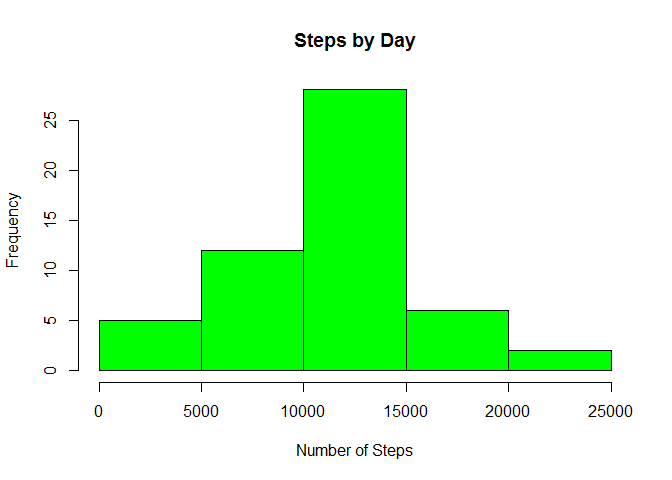
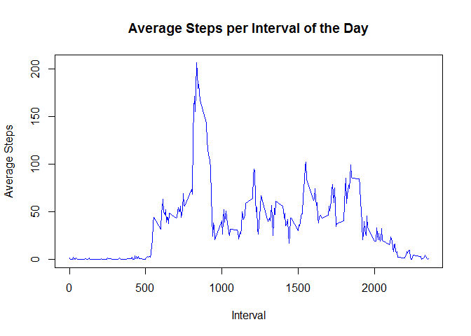
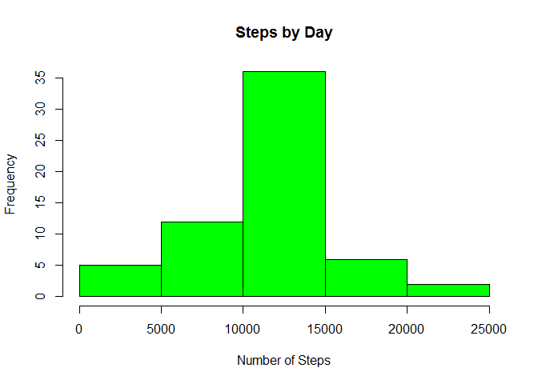

# Reproducible Research: Peer Assessment 1


## a) Loading and preprocessing the data


```r
library(plyr)
```

```
## Warning: package 'plyr' was built under R version 3.1.3
```

```r
library(dplyr)
```

```
## 
## Attaching package: 'dplyr'
## 
## The following objects are masked from 'package:plyr':
## 
##     arrange, count, desc, failwith, id, mutate, rename, summarise,
##     summarize
## 
## The following object is masked from 'package:stats':
## 
##     filter
## 
## The following objects are masked from 'package:base':
## 
##     intersect, setdiff, setequal, union
```

```r
library(lattice)

full_data = read.csv("C:/Users/Dan/Documents/repData/activity.csv")
clean_data = full_data[complete.cases(full_data),]
full_data$date <- as.Date(full_data$date)
```

## b) What is mean total number of steps taken per day?
### 01 - Calculate the total number of steps taken per day

```r
stepsPerDay = aggregate(clean_data$steps, by = list(clean_data$date), FUN = "sum" )
colnames(stepsPerDay) = c("day","steps")

print(stepsPerDay)
```

```
##           day steps
## 1  2012-10-02   126
## 2  2012-10-03 11352
## 3  2012-10-04 12116
## 4  2012-10-05 13294
## 5  2012-10-06 15420
## 6  2012-10-07 11015
## 7  2012-10-09 12811
## 8  2012-10-10  9900
## 9  2012-10-11 10304
## 10 2012-10-12 17382
## 11 2012-10-13 12426
## 12 2012-10-14 15098
## 13 2012-10-15 10139
## 14 2012-10-16 15084
## 15 2012-10-17 13452
## 16 2012-10-18 10056
## 17 2012-10-19 11829
## 18 2012-10-20 10395
## 19 2012-10-21  8821
## 20 2012-10-22 13460
## 21 2012-10-23  8918
## 22 2012-10-24  8355
## 23 2012-10-25  2492
## 24 2012-10-26  6778
## 25 2012-10-27 10119
## 26 2012-10-28 11458
## 27 2012-10-29  5018
## 28 2012-10-30  9819
## 29 2012-10-31 15414
## 30 2012-11-02 10600
## 31 2012-11-03 10571
## 32 2012-11-05 10439
## 33 2012-11-06  8334
## 34 2012-11-07 12883
## 35 2012-11-08  3219
## 36 2012-11-11 12608
## 37 2012-11-12 10765
## 38 2012-11-13  7336
## 39 2012-11-15    41
## 40 2012-11-16  5441
## 41 2012-11-17 14339
## 42 2012-11-18 15110
## 43 2012-11-19  8841
## 44 2012-11-20  4472
## 45 2012-11-21 12787
## 46 2012-11-22 20427
## 47 2012-11-23 21194
## 48 2012-11-24 14478
## 49 2012-11-25 11834
## 50 2012-11-26 11162
## 51 2012-11-27 13646
## 52 2012-11-28 10183
## 53 2012-11-29  7047
```

### 02 - Make a histogram of the total number of steps taken each day

```r
hist(stepsPerDay$steps, main = "Steps by Day", xlab = "Number of Steps", col = "green")
```

 

### 03 - Calculate and report the mean and median of the total number of steps taken per day

```r
medianStepsPerDay = median(stepsPerDay$steps) 
meanStepsPerDay = mean(stepsPerDay$steps)

print(medianStepsPerDay)
```

```
## [1] 10765
```

```r
print(meanStepsPerDay)
```

```
## [1] 10766.19
```

## c) What is the average daily activity pattern?

### 01 - Make a time series plot (i.e. type = "l") of the 5-minute interval (x-axis) and the average number of steps taken, averaged across all days (y-axis)


```r
avgPerInterval = aggregate(clean_data$steps, by = list(clean_data$interval), FUN = "mean" )
colnames(avgPerInterval) = c("interval","avgsteps")
plot(avgPerInterval$interval, avgPerInterval$avgsteps, type = "l", col = "blue", main = "Average Steps per Interval of the Day", xlab = "Interval", ylab = "Average Steps")
```

 

### 02 - Which 5-minute interval, on average across all the days in the dataset, contains the maximum number of steps?

```r
maxInterval = avgPerInterval[which(avgPerInterval$avgsteps == max(avgPerInterval$avgsteps)),]
colnames(maxInterval) = c("interval","steps")

print(maxInterval)
```

```
##     interval    steps
## 104      835 206.1698
```

## d) Imputing missing values

### 01 - Calculate and report the total number of missing values in the dataset (i.e. the total number of rows with NAs)


```r
totalNA = (nrow(full_data) - nrow(clean_data))

print(totalNA)
```

```
## [1] 2304
```

## 02 - Devise a strategy for filling in all of the missing values in the dataset. 

*** I will use the MEAN of the interval to fill the NAs

## 03 - Create a new dataset that is equal to the original dataset but with the missing data filled in.

```r
dataNA = full_data

for (i in 1:nrow(dataNA)) {
  if (is.na(dataNA$steps[i])) {
    dataNA$steps[i] = avgPerInterval[which(dataNA$interval[i] == avgPerInterval$interval), ]$avgsteps
  }
}
head(dataNA)
```

```
##       steps       date interval
## 1 1.7169811 2012-10-01        0
## 2 0.3396226 2012-10-01        5
## 3 0.1320755 2012-10-01       10
## 4 0.1509434 2012-10-01       15
## 5 0.0754717 2012-10-01       20
## 6 2.0943396 2012-10-01       25
```

```r
summary(dataNA)
```

```
##      steps             date               interval     
##  Min.   :  0.00   Min.   :2012-10-01   Min.   :   0.0  
##  1st Qu.:  0.00   1st Qu.:2012-10-16   1st Qu.: 588.8  
##  Median :  0.00   Median :2012-10-31   Median :1177.5  
##  Mean   : 37.38   Mean   :2012-10-31   Mean   :1177.5  
##  3rd Qu.: 27.00   3rd Qu.:2012-11-15   3rd Qu.:1766.2  
##  Max.   :806.00   Max.   :2012-11-30   Max.   :2355.0
```

## 04 - Make a histogram of the total number of steps taken each day and Calculate and report the mean and median total number of steps taken per day. Do these values differ from the estimates from the first part of the assignment? What is the impact of imputing missing data on the estimates of the total daily number of steps?


```r
stepsPerDayNA = aggregate(dataNA$steps, by = list(dataNA$date), FUN = "sum" )
colnames(stepsPerDayNA) = c("day","steps")

print(stepsPerDayNA)
```

```
##           day    steps
## 1  2012-10-01 10766.19
## 2  2012-10-02   126.00
## 3  2012-10-03 11352.00
## 4  2012-10-04 12116.00
## 5  2012-10-05 13294.00
## 6  2012-10-06 15420.00
## 7  2012-10-07 11015.00
## 8  2012-10-08 10766.19
## 9  2012-10-09 12811.00
## 10 2012-10-10  9900.00
## 11 2012-10-11 10304.00
## 12 2012-10-12 17382.00
## 13 2012-10-13 12426.00
## 14 2012-10-14 15098.00
## 15 2012-10-15 10139.00
## 16 2012-10-16 15084.00
## 17 2012-10-17 13452.00
## 18 2012-10-18 10056.00
## 19 2012-10-19 11829.00
## 20 2012-10-20 10395.00
## 21 2012-10-21  8821.00
## 22 2012-10-22 13460.00
## 23 2012-10-23  8918.00
## 24 2012-10-24  8355.00
## 25 2012-10-25  2492.00
## 26 2012-10-26  6778.00
## 27 2012-10-27 10119.00
## 28 2012-10-28 11458.00
## 29 2012-10-29  5018.00
## 30 2012-10-30  9819.00
## 31 2012-10-31 15414.00
## 32 2012-11-01 10766.19
## 33 2012-11-02 10600.00
## 34 2012-11-03 10571.00
## 35 2012-11-04 10766.19
## 36 2012-11-05 10439.00
## 37 2012-11-06  8334.00
## 38 2012-11-07 12883.00
## 39 2012-11-08  3219.00
## 40 2012-11-09 10766.19
## 41 2012-11-10 10766.19
## 42 2012-11-11 12608.00
## 43 2012-11-12 10765.00
## 44 2012-11-13  7336.00
## 45 2012-11-14 10766.19
## 46 2012-11-15    41.00
## 47 2012-11-16  5441.00
## 48 2012-11-17 14339.00
## 49 2012-11-18 15110.00
## 50 2012-11-19  8841.00
## 51 2012-11-20  4472.00
## 52 2012-11-21 12787.00
## 53 2012-11-22 20427.00
## 54 2012-11-23 21194.00
## 55 2012-11-24 14478.00
## 56 2012-11-25 11834.00
## 57 2012-11-26 11162.00
## 58 2012-11-27 13646.00
## 59 2012-11-28 10183.00
## 60 2012-11-29  7047.00
## 61 2012-11-30 10766.19
```

```r
hist(stepsPerDayNA$steps, main = "Steps by Day", xlab = "Number of Steps", col = "green")
```

 

```r
medianStepsPerDayNA = median(stepsPerDayNA$steps) 
meanStepsPerDayNA = mean(stepsPerDayNA$steps)

print(medianStepsPerDayNA)
```

```
## [1] 10766.19
```

```r
print(meanStepsPerDayNA)
```

```
## [1] 10766.19
```

***Answer: The mean stays the same. The Median rises by .19

## Are there differences in activity patterns between weekdays and weekends?

### 01 - Create a new factor variable in the dataset with two levels - "weekday" and "weekend" indicating whether a given date is a weekday or weekend day.

```r
dataNA = mutate(dataNA, dayOfWeek = ifelse(weekdays(date) %in% c('Saturday','Sunday'), 'Weekend', 'Weekday'))

head(dataNA)
```

```
##       steps       date interval dayOfWeek
## 1 1.7169811 2012-10-01        0   Weekday
## 2 0.3396226 2012-10-01        5   Weekday
## 3 0.1320755 2012-10-01       10   Weekday
## 4 0.1509434 2012-10-01       15   Weekday
## 5 0.0754717 2012-10-01       20   Weekday
## 6 2.0943396 2012-10-01       25   Weekday
```

```r
summary(dataNA)
```

```
##      steps             date               interval       dayOfWeek        
##  Min.   :  0.00   Min.   :2012-10-01   Min.   :   0.0   Length:17568      
##  1st Qu.:  0.00   1st Qu.:2012-10-16   1st Qu.: 588.8   Class :character  
##  Median :  0.00   Median :2012-10-31   Median :1177.5   Mode  :character  
##  Mean   : 37.38   Mean   :2012-10-31   Mean   :1177.5                     
##  3rd Qu.: 27.00   3rd Qu.:2012-11-15   3rd Qu.:1766.2                     
##  Max.   :806.00   Max.   :2012-11-30   Max.   :2355.0
```

```r
summary(factor(dataNA$dayOfWeek))
```

```
## Weekday Weekend 
##   12960    4608
```
## 02 - Make a panel plot containing a time series plot (i.e. type = "l") of the 5-minute interval (x-axis) and the average number of steps taken, averaged across all weekday days or weekend days (y-axis). See the README file in the GitHub repository to see an example of what this plot should look like using simulated data.


```r
avgPerIntervalNAWeek <- aggregate(dataNA$steps, list(interval = as.numeric(as.character(dataNA$interval)), dayOfWeek = dataNA$dayOfWeek), FUN = "mean")
colnames(avgPerIntervalNAWeek) = c("interval","dayofweek","avgsteps")
xyplot(avgPerIntervalNAWeek$avgsteps ~ avgPerIntervalNAWeek$interval | avgPerIntervalNAWeek$dayofweek, layout = c(1, 2), type = "l",xlab = "Interval", ylab = "Number of steps")
```

 
